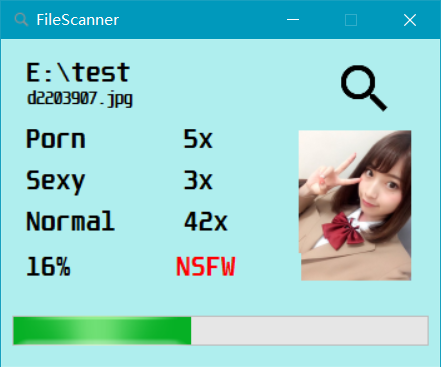

# NSFW_Scanner
Using [百度图像审核API(Baidu Image Censoring)](https://ai.baidu.com/tech/imagecensoring)
- Credits to the great idea and work of [Cover](http://coverapp.me/)(Cover Gallery Protector) team.

Reference:
- http://csharphelper.com/blog/2018/04/display-database-pictures-in-a-listview-control-in-c/

## PicInfo

## Judgement

## NSFW_Scanner

