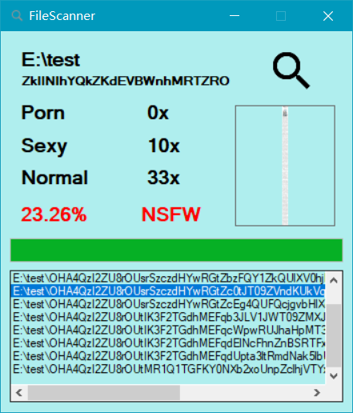

# NSFW_Scanner
- Powered by [百度图像审核API(Baidu Image Censoring)](https://ai.baidu.com/tech/imagecensoring) <br/>
  “百度内容审核基于深度学习的智能内容审核方案，准确识别图片和视频中的涉黄、涉暴涉恐、政治敏感、微商广告、恶心等内容，也能从美观和清晰等维度对图像进行筛选，快速精准，解放审核人力。”
- Credits to the great idea and work of [Cover](http://coverapp.me/) (Cover Gallery Protector) team.
- `Test Set` coming from [nsfw_data_scraper](https://github.com/alexkimxyz/nsfw_data_scraper), only for the purpose of programming and testing. <br/>
  :heavy_exclamation_mark: Please DO comply with the law as this program DOES.

## Token.config
  Create/Put under the startup directory of the program.
  ```XML
  <?xml version="1.0" encoding="utf-8" ?>
  <root>
    <APIKey>...YourAPIKeyHere...</APIKey>
    <SecretKey>...SecretKeyHere...</SecretKey>
    <MaxSize>1000000</MaxSize>
  </root>
  ```
  `MaxSize` is refered as max length (byte) of base64 coded file, and should not exceed 4M acrroding to Baidu's official document.

## Judgement


## NSFW_Scanner


